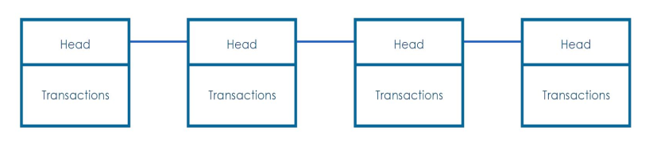

# mini-blockchain

This project is useful for understanding the basic concepts behind blockchain technology.

### Blockchain

#### A cryptographically linked sequence of blocks in a chronological order spanning across the nodes forms the blockchain.Blockchain is like an ever-growing book (ledger) with blocks forming the pages of it, in a sequential fashion and every node in the network having the exact same copy of the book. The network keeps on growing as long as new blocks get added to the network.

This is a simple python implementation of a mini block chain implementing the basic concepts of 
- hashing the transactions
- adding new blocks to the chain
- validating the chain
- proof of work

#### This is how a blockchain look like 

